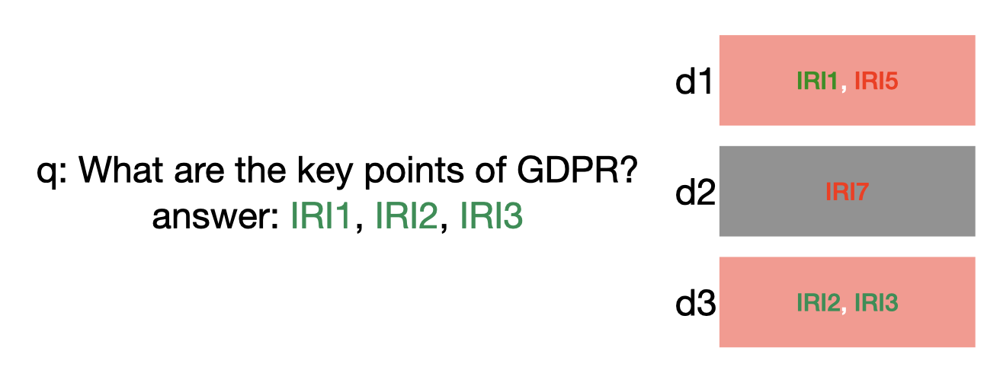
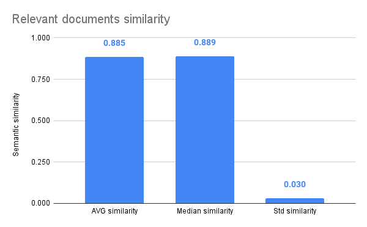
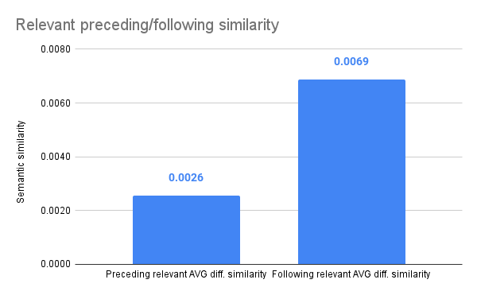
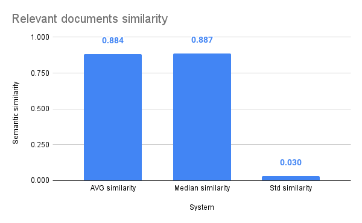
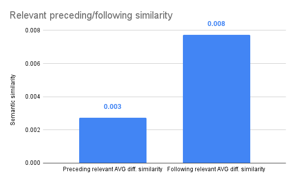

# Chat EUR\-Lex Search Engine Report

## Introduction
The Chat\-EUR\-Lex project is framed as a Retrieval Augmented Generation \(RAG\) application.\
The RAG approach represents an innovative paradigm in Natural Language Processing \(NLP\), amalgamating the virtues of retrieval\-based and generative models.\
Retrieval\-based models are proficient in retrieving pertinent information from extensive text corpora based on input questions. Although they excel in providing precise and factual data, such models are not suited to generate original content.\
Conversely, generative models possess the capability to fabricate text from scratch, showcasing creativity and diversity in outputs. However, they often struggle with accuracy and coherence, particularly in providing specific factual details.\
The RAG framework integrates both models by harnessing their respective strengths. It comprises two primary components:\
\(i\) Retriever. This component is tasked with efficiently sifting through vast knowledge repositories or textual corpora to extract relevant information. Employing methodologies such as information retrieval and similarity scoring, it discerns the most pertinent documents or passages aligned with the input query;\
\(ii\) Generator. Responsible for synthesizing information provided by the retriever into coherent and contextually appropriate responses, the generator component employs sophisticated language generation techniques, typically leveraging Large Language Models \(LLMs\). This ensures the production of text outputs of high quality, maintaining both factual accuracy and linguistic fluency.\
By harmonizing retrieval and generation mechanisms, the RAG system strikes a balance between precision and naturalness in text generation. It effectively addresses queries by furnishing accurate information while preserving the authenticity and coherence of the generated text. This renders it particularly valuable in applications such as question\-answering systems, dialogue systems, and content generation tasks where the fusion of accuracy and natural language fluency is paramount.

## Retriever
The first step in the creation of Chat\-EUR\-Lex in the RAG setting, is to develop the retriever \(the search engine\), that is, given the user question the retriever has to find the most relevant documents within the knowledge base.\
Given the large amount of regulations provided by the EUR\-Lex platform, we framed the retriever as similarity scoring: we exploited the notion of numerical vector representation —i.e. embeddings— of both user question and regulations in the database so as to efficiently compute similarity scores. 
More formally, given the regulations corpus $R = r_1, r_2, r_3, \dots , r_n$ where $r_i$ represents the body of the i\-th regulation, we pre\-computed the embedding of each such regulation $e(r_i)$, where $e$  represents the embedding function that converts a text into an N\-dimensional vector representing such text usually computed through an embedding model. 
Given the typical input size limits of embedding models, we splitted the body of each regulation into smaller text chunks so as to allow embeddings calculation, that is the regulation $r_i = w_1 \, w_2\, w_3 \dots w_l$ where $w_j$ is the j\-th word, we splitted the text in chunks of fixed size $c_{k,t}^{r_i}$ —i.e. the chunk of text from word $w_k$ to word $w_t$ of the regulation $r_i$ with $k < t$ — and computed the vector of each such chunk through the embedding model $e(c_{k,t}^{r_i})$.\
Once all the regulations have been processed, the embeddings are then injected into a vectorial database, that is a database specifically designed to store vector representations —for this project we employed QDrant as vectorial database—. Using a vector database is required so as to allow efficient and effective queries over a large corpus such as the EUR\-Lex database.\
Once the whole regulations corpus has been indexed on the vector database, the retrieval strategy works as follows: given a user question $q$ we compute the embedding of the query through the same embedding model $e(q)$ and compared such vector with all the representations for each regulations text chunks through the vector database interface, thus obtaining a ranking $\text{ranking}(q) = [q_1, q_2, q_3, \dots, q_k]$ of top\-k regulations text chunks.\
It is worth mentioning, that each element $q_i$ of the ranking is provided with a semantic similarity score computed through the cosine similarity metrics between the query and the corresponding document’s text

$$ \text{cos-sim}(V1, V2) = \frac{\sum_{i=1}^{n}V1_i,V2_i}{\sqrt{\sum_{i=1}^{n} V1_i} \cdot \sqrt{\sum_{i=1}^{n} V2_i}}.$$

In order to retrieve relevant documents for a user question we assessed the text\-embedding\-ada\-002 embedding model from OpenAI.

## Dataset

In order to assess the retrieval approach we should employ a dataset made of question\-answer pairs. Since the manual annotation of question\-answer pairs is a time\-consuming process, we automatically generated such a dataset by employing the OpenAI GPT\-3.5 turbo language model.

As mentioned above, in order to make regulations texts fit the input size of embedding models, we break down regulation bodies into smaller chunks of text, and we provide each such chunk with a Unique Chunk Identifier \(UCID\). Given the elevated amount of time needed to process each regulation, we selected a subset of 4098 regulations [\[1\]](#footnote-0) —we considered only Italian and English languages— for which we splitted the body into smaller text chunks.

Since we are interested in generating answers for each question in the RAG pipeline, we may be prone to automatically generate answers for selected questions in order to build the synthetic dataset. However, it should be considered that the process of question generation is rather time\-consuming and is the the primary objective of the RAG approach, so we opted to address the reverse problem: given a fraction of a regulation text we prompt the LLM to generate a question whose answer can be given using solely the information included in the provided text unit. It is worth noting that a text unit for which we generate a question may include multiple chunks, thus the answer for the question is generated by multiple UCIDs.

The proposed methodology yields a structured question\-paragraph pairing, aligning with our dataset needs and can be completely generated without human effort. To enhance the LLM contextual understanding of the paragraph, we also provide it with a larger section of the text from which the specific paragraph was extracted. This decision balances the need to include concise paragraphs —to make the model more focused— with the need to provide adequate context to facilitate the LLM generation of relevant questions.

### Dataset Generation

Given the corpus selected from the EUR\-Lex database, we processed each document for question generation. In particular, given the regulation $r_i$ the first step involves the text chunking, that is we split the regulation text into smaller text chunks $r_i = c_{k,t}^{r_i}$ where the size of the chunk —i.e. $t-k$— corresponds to line ends. Subsequently, we randomly select a text unit  —that may be formed by multiple consecutive chunks— from the regulation  so as to create the contextualized text that will be provided to the question generation stage: in order to contextualize the selected unit the text provided to the LLM is formed by adding surrounding chunks to the selected ones.\
Then we move to the question generation step on the contextualized text, that is, we call the OpenAI GPT3.5\-turbo model providing such text as context and we prompt the model to to create a question whose answer is contained only within the selected text unit .\
Eventually, a second call to the same OpenAI language model is performed and we prompt the model to rephrase the question generated in the previous step so as to avoid reusing the same words contained in the text unit  \(which would make the task easier\).\
This process is iterated on all the regulations within the corpus, thus generating a total of 118,620 questions. Questions were generated both in Italian and English languages. Interestingly, the model does not always align the language of the question with the language of the selected text unit, so we recorded both the language of the question and the language of the text unit.

## Evaluation

In order to assess the embedding model we designed two experimental settings on questions and documents extracted from the automatically generated dataset: the first consists in assessing the retrieval in a protected condition, where we search on a set of documents for which we have a question; the second setting is aimed at assessing the resilience of the embeddings, we injected external noise in the corpus so as to disturb the retrieval process. The evaluation consists in assessing the OpenAI embedding model \(text\-embedding\-ada\-002\) retrieval capabilities through both experimental conditions.\
It is worth noting that in all the experimental settings we consider a document di as relevant for the query $q$ —i.e. a hit of the retrieval approach— if di originates from at least one UCID indicated as answer for the question . Figure 1 shows an example of a question: given the question “What are the key points of GDPR?” and the set of UCIDs UCID1, UCID2 and UCID3 as valid answers, we consider as relevant the documents d1 and d3 due to the fact that both originates from at least one relevant UCID.

*Figure 1. Given the query q for which the answer has been generated through UCID1, UCID2 and UCID3, we consider as relevant for the query q the document d1 and d3.*

In the following we describe the metrics used to assess the embeddings in the question\-answering task \(Section [Metrics](#sec:metrics)\), then we describe the first experimental setting \(Section [Experiment 1](#sec:exp1)\) and the second experimental setting \(Section [Experiment 2](#sec:exp2)\). The descriptions of the experiments are accompanied by the results and a brief discussion.

### Metrics

As regards as for the metrics employed in the evaluation we decided to adopt the Mean Reciprocal Rank \(MRR\), the Normalized Discounted Cumulative Gain \(NDCG\) and the custom metric worst\-index.

__MRR@K__ indicates how soon is possible to find the first relevant item within the top\-K elements of the answers ranking. To calculate MRR we take the reciprocal of the rank of the first relevant document and average this value across all queries of the experiment.

__NDCG@K__ measures the quality of a ranking system, considering the position of relevant items in the ranked list while giving more weight to the items placed higher. NDCG relies on the idea of cumulative gain, which measures the total item relevance in a list. To give more credit to the items higher in the ranking, it uses DCG \(Discounted Cumulative Gain\). DCG introduces a logarithmic discount to give lower weight to items further in the list. Then, we divide the DCG by the gain of an ideally ranked list where all the items are perfectly sorted based on relevance, thus resulting in a normalized \(0 to 1\) metric that shows how the ranking compares to an ideal outcome for a given list.

__worst\-index__ indicates the highest index at which we have seen all the relevant UCIDs. The rationale underlying the worst\-index metrics is to find how many documents we have to retain so as to prove the full context to build the answer for the query.

Considering the example in Figure 1 the metrics will assume the following values: MRR@1 and MRR@3 will be 1, NDCG@1 and NDCG@3 will be 1, best\-index will be 1 and worst\-index will be 3 because after the third document we have retrieved all the relevant UCIDs \-i.e. UCID1, UCID2 and UCID3\-. In all the experimental settings, both MRR and NDCG have been assessed for K=10 and K=100.

### Experiment 1

The first experiment is aimed at evaluating embeddings in a context where questions are extracted exclusively from documents in the corpus, that is, we want to assess the quality of embeddings in a scenario where there is no external noise, all the documents within the corpus are related to at least one question.\
In order to build the dataset for such an experimental setting we selected a subset of 173 regulations out of the whole dataset and we retained the set of 2467 questions whose answers are contained in the subset of regulations. In this setting we considered all the text chunks of each such regulation, resulting in about 100,000 text documents as corpus for the experiment.\
Table 1.1 reports the results for the first experiment, here we computed the metrics for the OpenAI embeddings.

| **All data** | **Worst Index** | **NDCG@10** | **NDCG@100** | **MRR@10** | **MRR@100** |
|:------------:|:---------------:|:-----------:|:------------:|:----------:|:-----------:|
|     **mean** |           27.06 |        0.63 |         0.66 |       0.56 |        0.57 |
|      **std** |          210.56 |        0.37 |         0.33 |       0.41 |        0.40 |
|      **min** |               1 |        0.00 |         0.00 |       0.00 |        0.00 |
|      **25%** |               1 |        0.36 |         0.36 |       0.17 |        0.17 |
|      **50%** |               2 |        0.63 |         0.63 |       0.50 |        0.50 |
|      **75%** |               6 |        1.00 |         1.00 |       1.00 |        1.00 |
|      **max** |            6036 |        1.00 |         1.00 |       1.00 |        1.00 |

*Table 1.1. Results for Experiment 1. We report the worst\-index, NDCG@10, NDCG@100, MRR@10, MRR@100 for the OpenAI embedding model. Each metric is described through mean, standard deviation, minimum value, first quartile, second quartile, third quartile and the maximum value.*

As we can see from the results, if we consider the worst\-index, for 75% of queries the OpenAI model found all the relevant documents within the sixth position. However, the maximum index is extremely high \(6036\). The MRR supports the worst\-index data, indicating that in about half of cases we can find a relevant document within the second ranking position. In this respect we repeated such experiments by removing the outliers according to the worst\-index score: we removed from the test all the questions with a worst\-index over the 90% quantile. The results are reported in Table 1.2. As we can see, by removing the outliers for 75% of queries the model found all the relevant documents within the fourth position.

In addition, in order to assess the similarity scores provided by both models we performed additional analysis on similarity scores between question and retrieved documents. Figure 1.1 reports the average similarity score, the median and the standard deviation of the OpenAI model for relevant documents only.

As we can see from the picture, the scores provided by the embedding model are close to 0.9 on average. Additionally, if we consider the standard deviation we can see that the scores are clustered, the standard deviation to average ratio is 3.4%, this could make it difficult to establish a similarity threshold to select only relevant documents. In this respect, we additionally analyzed the average difference between the similarity score obtained for relevant documents and the preceding/following item in the ranking. The results are depicted in Figure 1.2. As we can see from the figure, the similarity scores provided by the OpenAI embedding model for documents preceding/following relevant documents are very close, i.e., the difference in scores for relevant documents is minimal compared to non\-relevant documents.

| **No outliers (10%)** | **Worst Index** | **NDCG@10** | **NDCG@100** | **MRR@10** | **MRR@100** |
|:---------------------:|:---------------:|:-----------:|:------------:|:----------:|:-----------:|
|              **mean** |            3.43 |        0.70 |         0.72 |       0.63 |        0.63 |
|               **std** |            4.21 |        0.33 |         0.29 |       0.38 |        0.37 |
|               **min** |               1 |        0.00 |         0.22 |       0.00 |        0.04 |
|               **25%** |               1 |        0.43 |         0.43 |       0.25 |        0.25 |
|               **50%** |               2 |        0.63 |         0.63 |       0.50 |        0.50 |
|               **75%** |               4 |        1.00 |         1.00 |       1.00 |        1.00 |
|               **max** |              23 |        1.00 |         1.00 |       1.00 |        1.00 |

*Table 1.2. Results for Experiment 1 without outliers. We report the worst\-index, NDCG@10, NDCG@100, MRR@10, MRR@100 for the OpenAI embedding model. Each metric is described through mean, standard deviation, minimum value, first quartile, second quartile, third quartile and the maximum value.*

*Figure 1.1. Similarity scores provided by the OpenAI model on relevant documents only. We reported average similarity, median and standard deviations.*

*Figure 1.2. Differences between similarity scores and preceding/following position in the same ranking.*

In addition we analyzed the similarity scores with respect to the ranking position: we computed the median of similarity scores for each ranking position of all the questions within the dataset, that is for each position $i$ in the ranking we computed $\text{median}(\text{ranking}(q_k, i))$ where $\text{ranking}(q_k, i)$ indicates the score for the i\-th document of the ranking for $q_k$. The results for the OpenAI model are reported in Figure 1.3.

As we can see from the pictures, the similarity scores for relevant documents are not always above the median score for each position for both models. However, if we consider the top 20 positions of rankings, we can see that the similarity scores for relevant documents is almost always above the aggregate scores for all documents, this may suggest that higher positions of the ranking are more reliable than lower ones.

*Figure 1.3. Median of similarity scores by ranking position for OpenAI model. We reported the scores for all documents ranked in each position \(blue score\) together with scores for relevant documents only \(red line\). We have some gaps due to the fact that OpenAI may not rank items at such positions, such as the interval between 83 and 87.*

### Experiment 2

The second experiment is aimed at evaluating embedding in a more real\-world scenario, in which the corpus contains both external noise and relevant documents. Specifically, the regulations in the corpus are equally divided into noise —regulations for which we have no related questions— and relevant regulations —regulations for which we have at least one question in the test set—.

In order to build the dataset for such an experimental setting, we selected a subset of 78 regulations out of the whole dataset and we retained the set of 1319 questions whose answers are contained in the subset of regulations. Additionally, we selected 3143 regulations for which we have no question, that is, we intend to select regulations that are not related to the questions.

In this setting we considered all the text chunks of each such regulation, resulting in about 100,000 text documents —about 50,000 as noise text and about 50,000 as relevant texts— as corpus for the experiment.

Table 2.1 reports the results for the second experiment, here we computed the metrics for the OpenAI embeddings.

| **All data** | **Worst Index** | **NDCG@10** | **NDCG@100** | **MRR@10** | **MRR@100** |
|:------------:|:---------------:|:-----------:|:------------:|:----------:|:-----------:|
|     **mean** |           18.04 |        0.67 |         0.69 |       0.61 |        0.61 |
|      **std** |          141.08 |        0.36 |         0.32 |       0.40 |        0.39 |
|      **min** |               1 |        0.00 |         0.00 |       0.00 |        0.00 |
|      **25%** |               1 |        0.39 |         0.39 |       0.20 |        0.20 |
|      **50%** |               2 |        0.63 |         0.63 |       0.50 |        0.50 |
|      **75%** |               5 |        1.00 |         1.00 |       1.00 |        1.00 |
|      **max** |            3510 |        1.00 |         1.00 |       1.00 |        1.00 |

*Table 2.1. Results for Experiment 2. We report the worst\-index, NDCG@10, NDCG@100, MRR@10, MRR@100 for the OpenAI embedding model. Each metric is described through mean, standard deviation, minimum value, first quartile, second quartile, third quartile and the maximum value.*

Consistently with the first experiment, if we consider the worst\-index, in the 75% of queries we can find all the relevant documents within the fifth position for the model. Accordingly, the MRR confirms that in about half cases the first relevant item is within the second position. Given that MRR at the second quartile is 0.5 and the worst\-index is 2 we may assume that the answer for a query is entirely contained in a single document, that is, there are no questions whose answer is divided into several documents. In addition, if we compare such results with those obtained for the first experiment, it seems that both models perform better on a setting where part of the corpus is not related to the questions rather than on the first setting.

Since the maximum value for the worst\-index is distant from the third quartile value, we repeated the same process employed for the first experiment and reported the results of such experiment by removing the outliers according to the worst\-index score. The results are reported in Table 2.2. As we can see, by removing the outliers for 75% of queries both the model found all the relevant documents within the fourth position.

| **No outliers (10%)** | **Worst Index** | **NDCG@10** | **NDCG@100** | **MRR@10** | **MRR@100** |
|:---------------------:|:---------------:|:-----------:|:------------:|:----------:|:-----------:|
|              **mean** |            2.75 |        0.74 |         0.75 |       0.68 |        0.68 |
|               **std** |            3.06 |        0.30 |         0.28 |       0.37 |        0.36 |
|               **min** |               1 |        0.00 |         0.24 |       0.00 |        0.06 |
|               **25%** |               1 |        0.50 |         0.50 |       0.33 |        0.33 |
|               **50%** |               1 |        1.00 |         1.00 |       1.00 |        1.00 |
|               **75%** |               3 |        1.00 |         1.00 |       1.00 |        1.00 |
|               **max** |              17 |        1.00 |         1.00 |       1.00 |        1.00 |

*Table 2.2. Results for Experiment 2 without outliers. We report the worst\-index, NDCG@10, NDCG@100, MRR@10, MRR@100 for the OpenAI embedding model. Each metric is described through mean, standard deviation, minimum value, first quartile, second quartile, third quartile and the maximum value.*

In addition, we repeated the assessment on the similarity scores provided by the model. Figure 2.1 reports the average similarity score, the median and the standard deviation for the OpenAI model for relevant documents only. Consistently with the first experiment, the scores provided by the embeddings are close to 0.9 on average. Additionally, we can see that the scores seem to be not sparse, the standard deviation to average ratio is 3.4%. In this respect, we repeated the analysis on the average difference between the similarity score obtained for relevant documents and the preceding/following item in the ranking. The results are depicted in Figure 2.2. As we can see from the figure, the similarity scores provided by the model for documents preceding/following relevant documents are very close.

Finally, we repeated the analysis of the similarity scores with respect to the ranking position. The results for the OpenAI model are reported in Figure 2.3. Consistently with the first experiment, the similarity scores for relevant documents are not always above the median score for each position for both models. However, if we consider the top 20 positions of rankings, we can see that the distance between the relevant document scores and the aggregate scores for all documents  seems not significant as for the first experiment, this may suggest that in a noisy condition we may rely on top\-10 ranking items only.

*Figure 2.1. Similarity scores provided by the OpenAI model on relevant documents only. We reported average similarity, median and standard deviations.*

*Figure 2.2. Differences between similarity scores and preceding/following position in the same ranking.*

*Figure 2.3. Median of similarity scores by ranking position for OpenAI model. We reported the scores for all documents ranked in each position \(blue score\) together with scores for relevant documents only \(red line\). We have some gaps due to the fact that OpenAI may not rank items at such positions, such as the interval between 83 and 87.*

# Conclusion

In this report we presented the search engine results of the RAG approach employed within the Chat\-EUR\-Lex project. In particular, we proposed a retriever approach based on the OpenAI embedding model so as to compute the semantic similarity scores between question\-answer pairs. We assessed the approach model in two experimental settings on automatically generated data.

The results obtained show that the similarity scores provided by the OpenAI embedding model are clustered towards 0.9, this may make it difficult to establish a similarity threshold to which to limit ranking. However, in both experimental settings, the model is able to find all the relevant information within the fifth position, that is, in order to generate a response to the user query we may need to account in most cases on the information included in the top five documents only. Consistently, the analysis on similarity scores suggests that we may consider only the top\-10 positions of the ranking to generate the answer, thus it seems well suited for the RAG approach: the size of the context that will be provided to the response generation module will be compatible with the limits posed to LLMs.

As further direction we leave unexplored the approach to fine\-tune a pre\-trained embedding model on question\-answer generated pairs.

1.  For the sake of clarity, from now on we will refer to the 4098 selected regulations as the full corpus. [↑](#footnote-ref-0)
